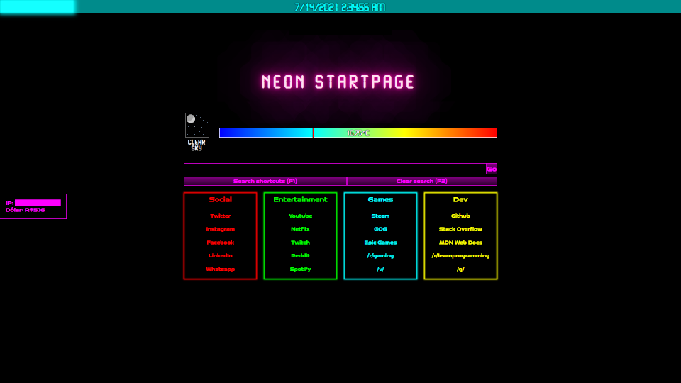

# Neon Startpage

## Features
- Easy to use.
- Easy to customize bookmarks and search engine shortcuts.
- No plugins, addons or additional downloads required.
- Integration with weather, currency and external IP APIs.
- Pixel art icons for weather conditions *(not pretty)*.

## How to install
1. Clone the repo somewhere in your machine.
2. Set the `index.html` as homepage.
3. Done!

## Customizing your startpage
You can check these files for the basic customization:

- `api_config.js`: Set your API keys and change API settings, such as update interval and the city for which weather information will be fetched.
- `bookmarks.js`: Create bookmark categories and add your own bookmarks to them.
- `search_engines.js`: Set the default search engine for the search bar and add custom search shortcuts.

## Default shortcuts
- **F1**: Expands/collapses the search shortcuts menu.
- **F2**: Clears the search input.
- **F3**: Selects the search input.
